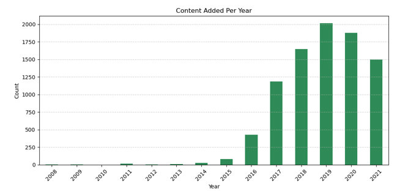
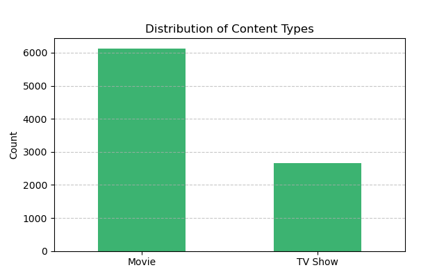
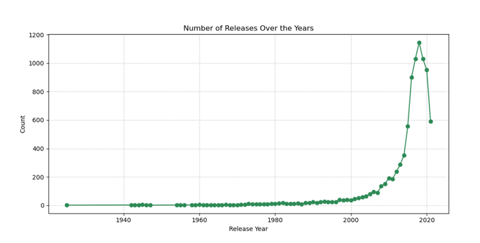
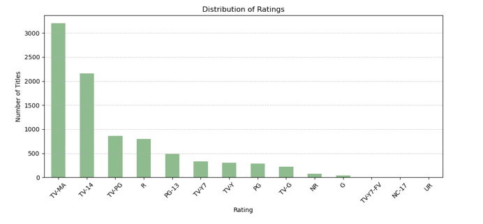
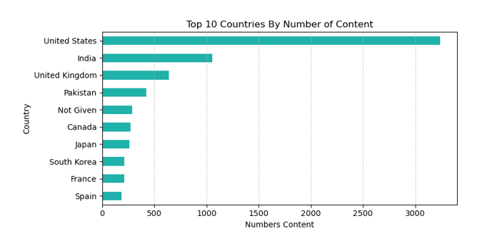

# 📊 Netflix Report

This report provides a comprehensive analysis of Netflix's content trends based on publicly available data. It covers the evolution of content growth, genre distribution, release year patterns, rating classification, and geographic diversity. Visualizations and insights are included to offer a clear picture of how Netflix's library has evolved over time, particularly with the rise of original content and global expansion.

---

## 📁 Project Structure

 - Netflix Report: Jupyter Notebook for data cleaning and EDA
 - Images: Folder containing all data visualizations used in the report

---

## 📚 Insights Summary

### 📈 Content Growth Over the Years  
Netflix’s content library expanded slowly from 2008 to 2014. A significant turning point occurred in 2015, followed by explosive growth until 2019, peaking at over 2,000 titles. Post-2019, the number of additions decreased—possibly due to the COVID-19 pandemic or a strategic focus on content quality and cost control.

``` python
years = df['Date Added'].dt.year
yearly_added = years.value_counts().sort_index()

# visualization 
plt.figure(figsize = (10, 5))
yearly_added.plot(kind = 'bar', color = 'seagreen')
plt.title('Content Added Per Year')
plt.xlabel('Year')
plt.ylabel('Count')
plt.xticks(rotation = 45)
plt.grid(axis = 'y', linestyle = '--', alpha = 0.6)
plt.tight_layout()
plt.show()

```




### 🎞️ Content Type Distribution  
Movies dominate Netflix's catalog with over 6,000 titles, while TV shows account for around 2,700. This skew toward films reflects a broader appeal, though the sizable show count highlights the importance of binge-worthy, episodic content for user retention.

``` python 
counts = df['Type'].value_counts()

# visualization
plt.figure(figsize = (6,4))
type_counts.plot(kind = 'bar', color = ['mediumseagreen', 'mediumseagreen'])
plt.title('Distribution of Content Types')
plt.xlabel('Type')
plt.ylabel('Count')
plt.xticks(rotation = 0)
plt.grid(axis = 'y', linestyle = '--', alpha = 0.7)
plt.tight_layout()
plt.show()

```




### 🕰️ Release Year Trends  
Older content is rare on the platform. A steady increase in content from the 2000s is visible, culminating in a sharp rise post-2010. Most titles were released between 2018 and 2020, suggesting Netflix’s focus on providing contemporary, fresh content to meet modern viewer preferences.

``` python
release = df['Release Year'].value_counts().sort_index()

plt.figure(figsize = (10, 5))
release.plot(kind = 'line', marker = 'o', color = 'seagreen')
plt.title('Number of Releases Over the Years')
plt.xlabel('Release Year')
plt.ylabel('Count')
plt.grid(True, linestyle = '--', alpha = 0.6)
plt.tight_layout()
plt.show()

```




### 🎭 Rating Distribution  
The platform leans heavily into mature content, with TV-MA as the most common rating (~3,200 titles), followed by TV-14 and TV-PG. This indicates a strong targeting of teen and adult demographics, with relatively limited family-friendly offerings.

``` python
rating = df['Rating'].value_counts()

# visualization
plt.figure(figsize = (10, 5))
rating.plot(kind = 'bar', color = 'darkseagreen')
plt.title('Distribution of Ratings')
plt.xlabel('Rating')
plt.ylabel('Number of Titles')
plt.xticks(rotation = 45)
plt.grid(axis = 'y', linestyle = '--', alpha = 0.6)
plt.tight_layout()
plt.show()

```




### 🌍 Content by Country  
The United States contributes the majority of content, with over 3,200 titles. However, countries like India, the UK, Japan, South Korea, and France show Netflix's global content strategy in action. This regional diversification supports the platform's expansion into new international markets.

``` python 
countries = df['Country'].value_counts().head(10)

# visualization
plt.figure(figsize = (8, 4))
countries.plot(kind = 'barh', color = 'lightseagreen')
plt.title('Top 10 Countries By Number of Content')
plt.xlabel('Numbers Content')
plt.gca().invert_yaxis()
plt.grid(axis = 'x', linestyle = '--', alpha = 0.6)
plt.tight_layout()
plt.show()

```




---

## ✅ Key Takeaways

- **Content Expansion Strategy**: Netflix prioritized aggressive content growth from 2015 to 2019. The decline after 2019 signals a potential pivot to quality-over-quantity or operational constraints like the pandemic.
  
- **Format Focus**: While movies are the dominant content type, the sizable collection of TV shows supports a hybrid strategy that caters to different viewer behaviors.

- **Modern Viewership Demand**: The content library is skewed toward newer releases, indicating Netflix's responsiveness to changing audience expectations for recent, high-production-value content.

- **Audience Targeting**: The rating distribution clearly targets older teens and adults, pointing to a content strategy focused on mature storytelling and complex narratives.

- **Global Strategy**: With a growing volume of titles from Asia and Europe, Netflix is clearly investing in localization and regional production to boost international subscriber growth.

---
